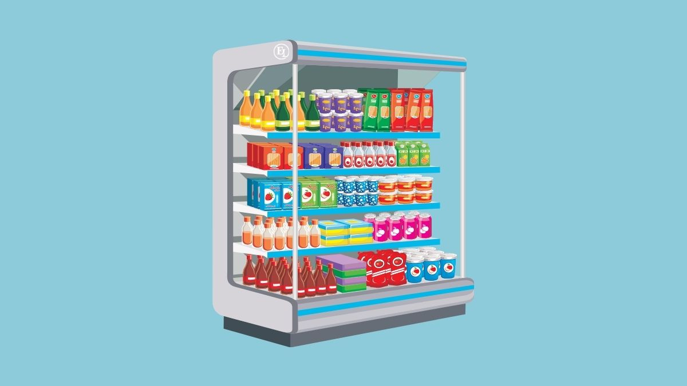

# Comparative analysis of clustered and non-clustered retail product forecasting 

## Context:
In retail business it is a challenge to have the right amount of products in stock. Forecasting can be used to predict how many products need to be in stock to comply with the demand of the product without having a surplus of the products. Product clustering is used for applying the same model to the products in the same cluster. In this analysis we use clustering to try and group the item time-series that have similar structure, which allows us to be prepared to handle items in same groups in a similar way in the future. To evaluate if forecasting is better with clustered products compared to non-clustered products, we perform the comparative analysis.

## Goal:
The goal of the analysis was to compare the forecasting accuracy (RMSE score) of clustered product (based on similar time series properties) vs non-clustered product.
